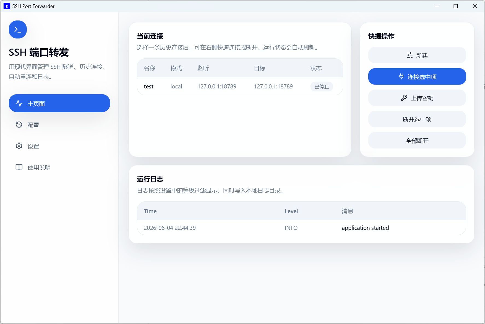
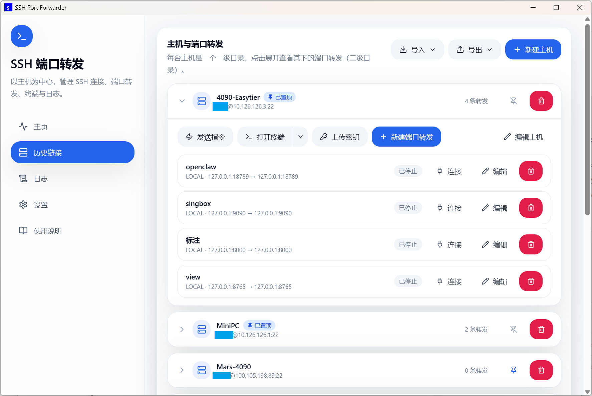

# SSH Port Forwarder

**中文** | [English](README.en.md)

一个面向 Windows 的可视化 SSH 管理工具。从 v0.2.0 起以**主机**为中心：每台 SSH 服务器是一个一级目录，其下挂载多条端口转发（二级目录），并支持发送指令、打开终端、上传密钥等操作。

## 界面预览





## 主要功能

- **以主机为中心的两级结构**：主机（连接参数）为一级目录，端口转发（监听/目标参数）为二级目录，点击主机即可展开。
- 支持 Local、Remote、Dynamic SOCKS 三种 SSH 转发模式。
- 每条转发独立连接、断开，可整机断开和全部断开，支持保持连接自动重连。
- **发送指令**：通过 SSH 在主机上执行一条指令，输出显示在弹窗中；支持免密或一次性密码两种方式。
- **打开终端**：弹出一个已通过 SSH 连上服务器的外部 PowerShell 窗口，支持 Tab 自动补全。
- **通过 VS Code 打开**：「打开终端」按钮右侧下拉新增「通过 VS Code 打开」。读取 VS Code Remote-SSH 的历史连接，按主机 IP 列出该主机下打开过的远端文件夹，点击即用 Remote-SSH 直接打开；也可「直连」（VS Code 默认方式连接、不打开文件夹）或「指定目录打开」（输入远端路径，`~` 与相对路径按家目录解析）。「直连」会在 `~/.ssh/config` 中按需补一条别名。自动探测 VS Code 安装位置（含注册表，支持非标准盘符）；未安装 VS Code 或 Remote-SSH 扩展时弹窗提示。
- **上传密钥**：把本机公钥写入远端 `authorized_keys` 配置免密登录（上传前先检测是否已可免密直连）。
- **跳板机（ProxyJump）**：新建主机可填跳板机字段，经由另一台主机跳转连接（可不填）。
- **导入 / 导出主机**：从导出文件或本机 `~/.ssh/config` 导入；导出到文件（含转发与端口，可再次导入）或写入 `~/.ssh/config`（仅 ssh 可解析的部分）。按主机 IP 去重，重复时可选「全部覆盖」或「仅导入不重复的」。
- **编辑配置即时生效**：改主机 IP 或用户会重启该主机下运行中的转发；改某条转发的 ip / 端口会自动断开并重连该条。
- 主机列表支持**置顶**，并按最后修改时间从新到旧排序。
- **新建端口转发前检测端口占用**：若监听端口被占用，弹窗会指出是本应用的哪条转发，或本机哪个进程（含 PID）。
- 连接时自动判断认证方式：能免密直连就直接连接，需要密码时自动弹窗输入（密码不写入配置）。
- 检测到远程主机指纹变化时弹窗提示，由你核对指纹后决定是否信任新密钥并重试。
- 主页是轻量监控板：当前连接按主机分组（左右双栏）完整展示，每条转发可单独断开，并有「新建」快捷入口；完整日志在独立的「日志」页。
- 新建端口转发默认不勾选「保持连接」；勾选后保存即自动连接，并暂存密码用于异常重连。
- 配置页空闲 3 分钟自动跳回主页。
- 支持 Debug、Info、Warning、Error 日志等级。
- 支持 dark / light 主题和中文 / 英文界面；**默认浅色**，设置项随界面语言切换。
- 启动时检测系统是否安装 OpenSSH 客户端；未安装时弹窗提示，可一键安装（管理员权限，从 Windows Update 下载）。
- 应用退出时自动清理由它启动的 SSH 转发进程；连接进程在后台运行，不额外弹出终端窗口。

## 下载与运行

从 GitHub Releases 下载 `v0.2.4`：

- 推荐下载安装包：`SSH Port Forwarder_0.2.4_x64-setup.exe`
- 也可以直接运行免安装程序：`ssh-port-forwarder.exe`

运行前请确认 Windows 已安装 OpenSSH Client，并且 PowerShell 中可以执行：

```powershell
ssh -V
```

## 快速上手

1. 打开程序后进入「配置」页，点击「新建主机」，填写 SSH 主机、用户、端口和私钥文件。
2. 展开该主机，点击「新建端口转发」，填写监听与目标参数。
3. 在转发上点击「连接」，程序会自动判断认证方式：能免密则直接连接，需要密码时会自动弹出密码输入框。
4. 在「主页」查看当前连接和关键事件，在「日志」页查看完整运行日志。

## 常用样例

如果远程服务器上有一个服务只监听 `127.0.0.1:8000`，你希望在本地浏览器打开它：

| 字段 | 填写 |
| --- | --- |
| 主机模式 | `local`（在端口转发里选） |
| SSH 主机 | 服务器 IP 或域名（建主机时填） |
| SSH 端口 | `22` |
| SSH 用户 | `root` / `ubuntu` / `deploy` |
| 监听地址 | `127.0.0.1` |
| 本机访问端口 | `8000` |
| 目标地址 | `127.0.0.1` |
| 远程待映射端口 | `8000` |

连接成功后，在本地浏览器访问：

```text
http://127.0.0.1:8000
```

等价命令大致是：

```powershell
ssh -N -T -L 127.0.0.1:8000:127.0.0.1:8000 用户名@服务器地址 -p 22
```

## 转发模式怎么选

| 模式 | 适用场景 |
| --- | --- |
| Local | 把本地端口转发到远程服务器能访问到的服务。最常用，适合远程数据库、远程 Web 服务。 |
| Remote | 把远程端口反向转发到本机服务。适合临时暴露本地开发服务。 |
| Dynamic | 创建 SOCKS 代理。通常只需要监听地址和本机访问端口。 |

## 密钥文件怎么填

主机的「私钥文件」字段：

- 留空：使用默认 `%USERPROFILE%\.ssh\id_ed25519`。
- 绝对路径：例如 `C:\Users\you\.ssh\id_rsa`。
- `~` 写法：例如 `~/.ssh/id_ed25519`。
- 请指向**私钥本身**，不要填 `.pub` 公钥文件。
- 如果该路径下没有私钥，「上传密钥」会自动生成一对 ed25519 密钥再上传公钥。

## 密码与密钥

推荐优先使用 SSH 密钥或 `ssh-agent`。

如果还没有配置免密登录，可以在主机上点击「上传密钥」，输入一次密码后，程序会把本地公钥写入远程主机的 `authorized_keys`，之后即可免密连接。

如果该主机只能用密码登录，直接点击转发的「连接」即可——程序检测到需要密码时会自动弹出密码输入框：

- 密码不会保存到配置文件。
- 如果开启「保持连接」，密码只会在本次应用运行期间保留在内存中，用于异常断开后的自动重连。
- 首次连接新主机时，程序使用 OpenSSH 的 `accept-new` 策略自动记录指纹；若之后指纹发生变化，连接会被拒绝并弹窗，由你核对后决定是否信任新密钥。

> 「发送指令」和「打开终端」依赖已配置好的免密登录。

## 数据保存位置

主机与转发配置、设置和日志保存在 Windows 应用数据目录中，不会保存在源码目录或程序所在目录。
v0.1.x 的旧 `profiles.json` 不再使用，启动时会自动备份为 `profiles.json.v0.1.bak`。

## 贡献者

- Trilives
- Codex
- Claude

## 开源协议

本项目采用 MIT 协议，可自由使用、修改和分发，详见 [LICENSE](LICENSE)。

> 这是一时兴起做的小项目，最初只是为了方便自己用，顺手开源出来，欢迎自取。

## 技术文档

- 架构、数据模型与模块划分见 [ARCHITECTURE.md](ARCHITECTURE.md)。
- 开发环境、构建和发布说明见 [TECHNICAL.md](TECHNICAL.md)。
