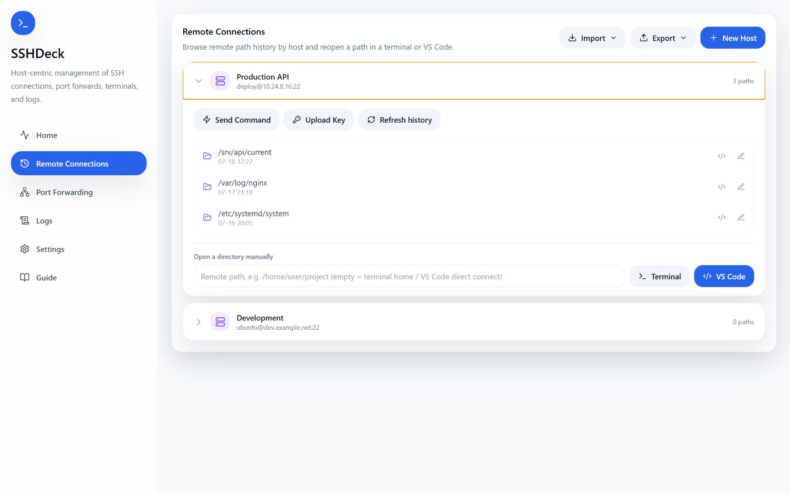
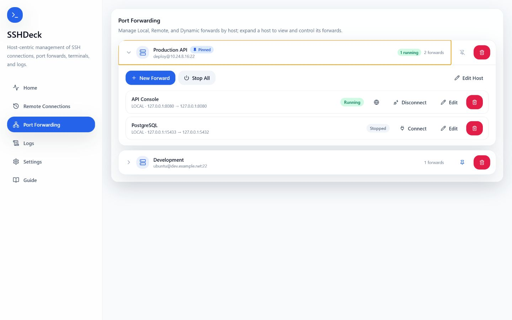

# SSHDeck

**English** | [中文](README.zh.md)

SSHDeck is a visual SSH management tool for Windows. Since v0.2.0 it is **host-centric**: each SSH server is a top-level item, with multiple port forwards (second level) nested beneath it, plus actions like sending commands, opening a terminal, and uploading keys.

## Screenshots

Click either preview to open the original 1440×900 image.

### Remote Connections

[](docs/Pictures/preview-en-remote.png)

### Port Forwarding

[](docs/Pictures/preview-en-forwarding.png)

## Features

- **Host-centric, two-level structure**: a host (connection parameters) is the top level, and a port forward (bind/target parameters) is the second level — click a host to expand it.
- Supports Local, Remote, and Dynamic SOCKS forwarding modes.
- Each forward connects/disconnects independently; you can disconnect a whole host or everything, with keep-alive auto-reconnect.
- **Dedicated Remote Connections and Port Forwarding pages**: both pages are grouped by host. Expanding a host on Remote Connections shows its historical remote paths; expanding one on Port Forwarding shows its current forward configuration and controls.
- **Open in browser**: a running forward can be opened in your default browser at its listening port (`http://<bind host>:<local port>`, with `0.0.0.0` treated as `127.0.0.1`) — available on both the Home and Port Forwarding pages; most useful for Local forwards.
- **Send command**: run a single command on the host over SSH, with output shown in a dialog; works passwordless or with a one-time password.
- **Open terminal**: launches an external PowerShell window already connected to the server over SSH, with Tab completion.
- **Open in VS Code**: the Remote Connections page reads VS Code Remote-SSH history (preferring the extension's freshest list), matches folders to each host by IP, and lets you reopen a path in VS Code or a terminal. You can also connect directly or enter a remote path manually; `~` and relative paths resolve against the remote home directory. VS Code and the Remote-SSH extension are detected automatically.
- **Upload key**: writes your local public key into the remote `authorized_keys` for passwordless login (it first checks whether passwordless access already works).
- **Jump host (ProxyJump)**: a host can specify a jump host to connect through another machine (optional).
- **Import / export hosts**: import from an exported file or your local `~/.ssh/config`; export to a file (with forwards and ports, re-importable) or write into `~/.ssh/config` (only the ssh-resolvable parts). Deduplicated by host IP — on conflict, choose "Overwrite all" or "Import non-duplicates only".
- **Config edits take effect immediately**: changing a host's IP or user restarts that host's running forwards; changing a forward's ip / port disconnects and reconnects just that forward.
- The host list supports **pinning** and is sorted by last modified time, newest first.
- **Automatic local-port fallback**: on connect, if the configured local port is already in use, it auto-increments (+1) to the first free port and listens there; the Home page and "Open in browser" show the actual port. It only errors if a whole range from that port is occupied (and then names the forward or process, with PID).
- Authentication is detected automatically on connect: passwordless if possible, otherwise a password prompt appears (passwords are never written to config).
- If the remote host key changes, a dialog warns you so you can verify the fingerprint before deciding to trust the new key and retry.
- The Home page is a lightweight dashboard: current connections are grouped by host, each forward can be disconnected individually, and there is a "New" shortcut; pinned hosts provide quick access to Remote Connections, while full logs live on a separate Logs page.
- New forwards default to "keep connected" off; once enabled, saving connects automatically and caches the password for reconnects.
- The Port Forwarding page returns to Home after 3 minutes of inactivity.
- Log levels: Debug, Info, Warning, Error.
- Dark / light themes and Chinese / English UI; **light by default**, and the settings options follow the UI language.
- On startup it checks whether the OpenSSH client is installed; if not, a dialog offers one-click install (admin rights, downloaded from Windows Update).
- On exit, it cleans up the SSH forward processes it started; connection processes run in the background without extra terminal windows.
- **In-app updates**: Settings → Software Update checks GitHub Releases and installs a newer signed build in place (with a restart), so you don't have to download the installer manually. Turn on **Automatic updates** to have updates install on startup; leave it off and a small notice appears on the main screen when one is available.

## Download & Run

Download `v0.3.0-beta.5` from GitHub Releases:

- Recommended installer: `SSHDeck_0.3.0-beta.5_x64-setup.exe`
- Install-free ZIP: `SSHDeck_0.3.0-beta.5_x64-portable.zip` — extract it, then run `SSHDeck.exe` directly.

The portable package stores settings and hosts in `%LOCALAPPDATA%\SSHDeck\data`, not beside the executable. It requires Windows OpenSSH Client and Microsoft Edge WebView2 Runtime. To remain install-free, update it by downloading a newer portable ZIP; the in-app updater follows the installer update path.

> Upgrading from beta.4 or earlier: export your hosts before updating, then import them in beta.5. The old data directory is not migrated automatically.

Using the installed edition? Open **Settings → Software Update** and click **Check for updates**.

Before running, make sure the Windows OpenSSH Client is installed and that PowerShell can run:

```powershell
ssh -V
```

## Quick Start

1. Open the app, go to Remote Connections, click "New Host", and fill in the SSH host, user, port, and private key file.
2. Go to Port Forwarding, expand the host, click "New Forward", and fill in the bind and target parameters.
3. Click "Connect" on the forward. The app detects the auth method automatically: it connects directly when passwordless, or pops up a password prompt when needed.
4. Use the Home page to watch current connections and key events, and the Logs page for the full runtime log.

## Common Example

Suppose a service on the remote server listens only on `127.0.0.1:8000` and you want to open it in your local browser:

| Field | Value |
| --- | --- |
| Mode | `local` (chosen in the port forward) |
| SSH host | server IP or domain (set on the host) |
| SSH port | `22` |
| SSH user | `root` / `ubuntu` / `deploy` |
| Bind host | `127.0.0.1` |
| Local access port | `8000` |
| Target host | `127.0.0.1` |
| Remote port to map | `8000` |

After connecting, open in your local browser:

```text
http://127.0.0.1:8000
```

The equivalent command is roughly:

```powershell
ssh -N -T -L 127.0.0.1:8000:127.0.0.1:8000 user@server -p 22
```

## Choosing a Forwarding Mode

| Mode | When to use |
| --- | --- |
| Local | Forward a local port to a service the remote server can reach. Most common — good for remote databases and web services. |
| Remote | Reverse-forward a remote port to a local service. Good for temporarily exposing a local dev service. |
| Dynamic | Create a SOCKS proxy. Usually only the bind host and local access port are needed. |

## Filling in the Key File

The host's "Key File" field:

- Empty: uses the default `%USERPROFILE%\.ssh\id_ed25519`.
- Absolute path: e.g. `C:\Users\you\.ssh\id_rsa`.
- `~` form: e.g. `~/.ssh/id_ed25519`.
- Point to the **private key itself**, not the `.pub` public key file.
- If no private key exists at that path, "Upload Key" generates an ed25519 key pair first and then uploads the public key.

## Passwords & Keys

Prefer SSH keys or `ssh-agent`.

If passwordless login is not set up yet, click "Upload Key" on the host, enter the password once, and the app writes your local public key into the remote host's `authorized_keys` so you can connect without a password afterward.

If the host only allows password login, just click "Connect" on the forward — when a password is required, a prompt appears automatically:

- The password is not saved to the config file.
- If "keep connected" is enabled, the password is kept only in memory during this app session, for reconnecting after unexpected drops.
- On first connection to a new host, the app records the fingerprint using OpenSSH's `accept-new` policy; if the fingerprint later changes, the connection is refused and a dialog lets you verify before trusting the new key.

> "Send command" and "Open terminal" rely on passwordless login being configured.

## Where Data Is Stored

Host and forward config, settings, and logs are stored in the Windows app-data directory, never in the source tree or the program folder.
The old `profiles.json` from v0.1.x is no longer used; it is backed up to `profiles.json.v0.1.bak` on startup.

## Contributors

- Trilives
- Codex
- Claude

## License

This project is licensed under the MIT License — free to use, modify, and distribute. See [LICENSE](LICENSE).

> A small project made on a whim, originally just for my own use, open-sourced along the way. Help yourself.

## Technical Docs

- Architecture, data model, module layout, tech stack, dev environment, build, and release notes: see [docs/ARCHITECTURE.md](docs/ARCHITECTURE.md).
